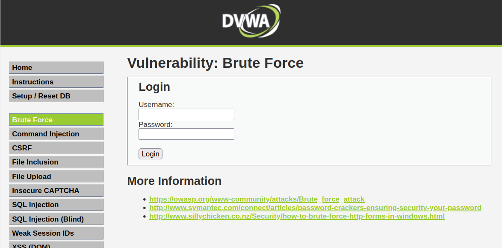

# FUERZA BRUTA CON PYTHON

Se a creado un script en python que te permitira realizar un ataque de fuerza bruta a diferentes paginas web, tambien se a creado un archivo para `user` y `password` donde se puede agregar o quitar valores para tu diccionario personalizable.

## Requisitos
- requests
```
pip install requests
```
- termcolor
```
pip install termcolor
```
## Pagina a Vulnerar


## Plantillas para el script en Python

### Linux

- Sin entorno Virtual
```
#!/usr/bin/python3
# -*- coding: utf-8 -*-
# Autor:
```

- Con entorno Virtual
```
#!/usr/bin/env python3
# -*- coding: utf-8 -*-
# Autor:
```
